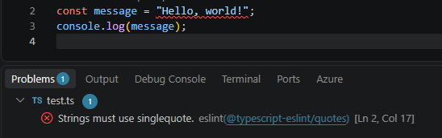

 
  
   

<h2 align="center"> Learning Through ESLint</h2>

I believe some coding standards can help you learn a programming language, and ESLint is a good example. After using it with VSCode, I found that it points out small mistakes as I write, which teaches me the language's conventions in the moment instead of after the fact. For instance, being told about an unused variable or a missing type makes me ask why it matters, and answering that question teaches me something about how TypeScript works. Much like static typing, it catches problems before I run the code, saving me from hunting through many lines for one wrong character or mistyped word.

<h2 align="center"> My Impressions After Using ESLint with VSCode</h2>

After using ESLint with VSCode, I think coding standards are important and can genuinely help you learn programming. I see them as necessary for understanding code and keeping it easy to read while still looking nice. Consistent formatting makes my code easier to follow, and ESLint keeps it that way without me having to think about it. Overall, I find the process pleasant.

<h2 align="center"> Painful, Useful, or Both?</h2>

Getting rid of every ESLint error can be tedious at first, especially when you fix the same small mistakes over and over. However, it really does make a difference. As the errors became less frequent, I noticed I was writing cleaner code on the first try, and the process stopped feeling like a chore. In the end, I find ESLint to be both a little painful and very useful. Coding standards are not just about making code look nice. They are a practical tool for writing better software and becoming a better programmer.

**AI Disclaimer: AI used for spelling and grammar checks. Thoughts, Ideas, Writing, are all the work of the Author**
